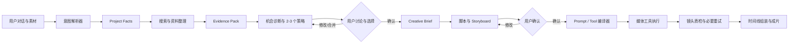

# 大模型工具编排架构

- 状态：草案
- 建立日期：2026-09-05
- 目标：定义大模型在平台中的职责、工具边界和可恢复执行方式

## 平台定位

平台不是一组固定视频模板，也不是单次提示词包装器。它是一个大模型驱动的内容创作工具：用户用自然语言描述目标，大模型持续整理信息、搜索资料、生成文案和 Storyboard，并在确认后调用媒体工具完成素材生成、组装、质检和导出。

大模型负责理解、规划和选择工具；任务系统负责确定性执行、状态、超时、重试、成本和产物。二者通过版本化结构化对象连接，不能依赖一段不可恢复的长对话完成整条视频。

## 主流程

## 七个大模型阶段

### 1. 意图解析

把用户消息和上传素材转为 `CreativeRequest`，提取内容方向、主体、目标、必须保留的文案、镜头顺序、人物、环境、动作和未说明参数。所有提取结果带来源位置，避免模型把自己的补全误当成用户输入。

### 2. 搜索与资料整理

模型生成多个搜索查询，调用搜索、网页读取和媒体检索工具，把结果整理为 Evidence Pack。搜索不是把网页原文直接塞入最终提示词，而是提取候选事实、视觉特征、图片线索、来源、时间和冲突。

信息优先级：当前项目中用户明确确认的事实、用户上传素材、可直接读取的产品/主题来源、多个一致的搜索结果、单一搜索摘要。低优先级结果不能静默覆盖高优先级事实。

### 3. 创意顾问

基于 CreativeRequest、Account Brief 和 Evidence Pack 先诊断内容机会，再生成 2 至 3 个 Strategy Proposal。每个方案包含受众、目标、Hook、核心承诺、视觉回报、节奏、情绪峰值、结尾、素材要求、资源等级、推荐理由和限制。用户可追问、修改或合并，确认后编译为不可变 CreativeBriefVersion。

Advisor 只能说明建议与依据，不能承诺播放量。用户提供的宣传语原样保留；搜索不到的性能参数不作为确定事实补写。

### 4. 脚本生成

把已确认 Creative Brief 扩展为短句旁白、屏幕文字、声音气氛和内容节奏。Brief 发生实质修改时创建新版本，并明确标记下游脚本和 Storyboard 是否过期。

### 5. Storyboard 导演

把自然语言段落拆成原子 Shot，为每个 Shot 定义叙事目的、画面、运镜、人物/主体、时长、声音和连续性要求。导演阶段只使用平台支持的镜头类型和参数范围。

### 6. 工具编译与执行

确认后的 Storyboard 编译成不可变 Shot Manifest。模型根据输入素材、镜头类型、质量和成本选择执行工具，并生成供应商相关提示词。任务系统校验 Manifest 后异步执行，模型不能直接操作数据库或运行任意系统命令。

### 7. 结果评估与修订

视觉模型检查主体一致性、关键动作、构图、文字错误、黑帧和明显变形；确定性工具检查编码、时长、帧率和音轨。失败只重做对应 Shot。模型在预先允许的重试次数内调整提示词，超过限制后交给用户替换或接受降级结果。

## 平台工具目录

| 工具 | 输入 | 输出 | 说明 |
| --- | --- | --- | --- |
| `search_web` | 查询、语言、时间范围 | 搜索结果列表 | 只返回候选来源，不直接形成事实 |
| `fetch_page` | URL | 清洗正文与元数据 | 用于进一步验证和提取信息 |
| `search_media` | 主体、场景、媒体类型 | 图片/视频候选 | 返回缩略图和技术信息 |
| `analyze_media` | 用户或搜索素材 | 主体、镜头、质量、视觉特征 | 建立 Reference Pack |
| `generate_image` | 参考图、提示词、比例、种子 | 图片 Artifact | 车型定妆、分镜预览和图片动画输入 |
| `generate_video` | 参考图/视频、提示词、时长 | 视频 Artifact | 适配多个外部或自建模型 |
| `render_blender` | Shot Manifest | 帧序列或视频 | 360°、产品特写和可控 3D 镜头 |
| `synthesize_speech` | 文案、音色、节奏 | 音频与时间戳 | 为字幕对齐提供词级或句级时间 |
| `generate_music` | 情绪、节奏、时长 | 音乐 Artifact | 可由素材库替代 |
| `compose_timeline` | 视频、音频、字幕和时间线 | 成片 | 由确定性媒体 Worker 执行 |
| `inspect_output` | Artifact 与目标约束 | 质量报告 | 视觉模型与媒体探测器组合 |

所有工具使用统一 Envelope：`toolCallId`、输入 Schema 版本、幂等键、截止时间、预算、重试策略、调用模型/服务、结果 Artifact 和错误分类。

## 状态与记忆

需要严格区分四类信息：

- `User Message`：原始对话，不做覆盖。
- `Project Facts`：用户确认的主体、车型、宣传语和硬约束。
- `Evidence Pack`：搜索得到的候选事实、来源和冲突。
- `Strategy Proposal`：模型建议的候选方向、理由、限制和资源等级。
- `Creative Brief`：用户选择或合并后确认的创意决策。
- `Creative Decisions`：基于 Brief 形成并经用户确认的脚本和镜头。

“张雪 800X 是一款车”属于 Project Fact。即使搜索大量返回凯越 800X，也只能在 Evidence Pack 中记录冲突，不能把 Project Fact 改成凯越 800X。

## 为什么不使用一个总控提示词

单个长提示同时搜索、写脚本、规划镜头、生成素材和合成，遇到失败后无法知道从哪里恢复，也无法只重做一个镜头。分阶段结构化输出能让用户确认、工具校验、成本计量和局部重试成为平台能力。

首期可以使用同一个基础模型承担多个阶段，但每个阶段使用独立提示、输入 Schema、输出 Schema 和版本号。只有当成本、质量或上下文规模证明有必要时，再为搜索、导演或评估选择不同模型。

## 首期 POC 验证

使用“张雪 800X”和“春风 800MT”两个输入验证：

1. 从自由文本稳定提取车型、宣传语和镜头顺序。
2. 搜索误匹配不会覆盖用户确认事实。
3. 一个内容段落能拆成多个原子 Shot。
4. 修改单个镜头后只重新生成对应 Artifact。
5. 工具失败后能自动重试或降级，并向用户保留可理解状态。
6. 每次搜索、模型调用和媒体生成均可追溯到最终镜头。
7. 每个样例能产生实质不同的策略，且用户可合并为新的 Brief 版本。
