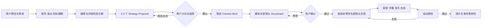

# 候选平台架构

- 状态：草案
- 更新日期：2026-09-05
- 前置条件：首期用户与真实车型要求已确认；资产来源、时延和成本尚待确认

## 设计原则

- 混合生成：每个镜头可使用用户素材、AI 图片/视频、Blender 3D、库存素材或组合结果。
- 镜头中心：Shot 是生成、渲染、重试、计费和审核的最小业务单元。
- 先预览后精渲：在高成本 GPU 工作之前完成人工确认。
- 可复现：所有输入、模型、提示词、种子、模板、脚本和工具版本可追溯。
- 可替换：LLM、图像、视频、TTS、音乐和 3D 生成均通过适配器接入。
- 垂直内容包：通用创作主干保持稳定，摩托车、母婴、育儿分别提供领域配置和执行能力。
- 失败隔离：单镜头失败不使整条项目从头重做。
- 创作执行隔离：艺术师可用的任意 Blender Python/MCP 能力不能进入面向租户的生产执行面。
- 大模型编排：模型负责理解、搜索、规划和选择工具，确定性任务系统负责执行、重试和保存产物。
- 决策先于脚本：模型先诊断内容机会并让用户确认 Creative Brief，再生成脚本和 Storyboard。

## 端到端工作流

## 逻辑组件

### 平台核心与垂直内容包

平台核心负责账号、项目、项目事实、证据、策略方案、创意简报、脚本版本、Storyboard、审批、生成运行、产物、质检和导出。它只理解“内容项目”和“镜头”，不假设所有视频都使用 3D 或 Blender。

每个垂直内容包定义自己的：

- 输入表单和资料 Schema。
- 创意/脚本提示模板、结构化输出和事实来源策略。
- Advisor Playbook、内容类型、方案评分权重和解释模板。
- 可用镜头类型、素材来源、渲染策略和默认风格。
- 领域资产目录、资产匹配器和降级规则。
- 内容审核、真实性检查和质量评分器。
- UI 预设、示例项目和领域术语。

摩托车内容包提供车型语义、视觉参考、Blender 资产、车辆镜头和材质参数，并能在用户视频、参考图生视频、AI 视频和 3D 渲染之间选择。母婴/育儿内容包可使用实拍素材、图像动画、数字人或生成视频，并定义相应的事实准确度规则。新增内容包不应修改平台核心状态机。

### Web 创作台

负责项目创建、资料上传、AI 创意咨询、方案比较/合并、Creative Brief 确认、脚本编辑、Storyboard、车型与材质配置、预览、审批、任务状态和成片下载。终端用户界面不直接暴露 Blender 或模型节点。

候选技术：Next.js + React + TypeScript。视频画布和 Storyboard 先使用浏览器标准媒体能力；是否引入 Remotion 要等公司主体与许可成本确认。

### 控制面 API

负责身份、租户、项目、版本、资产元数据、审批、配额、费用估算和任务提交。候选技术为 FastAPI，因为 Blender、媒体与 AI 工具链主要在 Python；接口使用 OpenAPI，长任务只返回 Run ID。

### 模型网关与管理面

业务服务只按 `creative-advisor`、`storyboard-director` 等能力别名调用项目自己的 ModelGateway。P0 使用 LiteLLM SDK 适配不同大模型平台；Provider、API Key、物理模型和主备路由通过内部 `/admin` 管理界面配置。

路由采用 Draft、探针、发布和回滚流程。每个运行保存 RoutingPolicyVersion 快照，发布新配置只影响新请求。Key 只写入服务端 Secret Store，数据库保存引用，浏览器和日志不回显明文。完整设计见[模型接入规格](../specs/model-provider-routing.md)和[模型管理后台体验规格](../specs/model-management-console.md)。

### 大模型编排服务

负责意图解析、搜索计划、Evidence Pack、内容机会诊断、Strategy Proposal、Creative Brief 编译、脚本、Storyboard、工具选择和结果评估。各阶段使用结构化输入输出并独立版本化；完整设计见[大模型工具编排架构](llm-tool-orchestration.md)。

### 持久化工作流

把创意、素材、预览、逐镜头渲染、合成和质检编排成可恢复状态机，支持暂停、取消、超时、重试和人工审批。

候选一是 Temporal，适合正式平台的长任务和恢复；候选二是 BullMQ/Celery 加 PostgreSQL 状态机，部署较轻但需要自行维护补偿和一致性。应通过一个包含“镜头失败后重试、Worker 中断后恢复、用户取消”的 POC 决定。

### 供应商适配层

统一 LLM、图片、视频、TTS、音乐、抠图、超分和可选 3D 生成接口。每次调用记录供应商、模型、请求版本、种子、费用、耗时、原始响应和产物。

ComfyUI 可作为内部 AI 媒体 Worker，而不是业务数据库或终端 UI。生产工作流引用固定版本的 Comfy workflow JSON 和已审核自定义节点。

### 资产注册表

管理通用素材以及垂直内容包的领域资产。摩托车包包括用户参考素材、AI 生成参考、车型、骑手、场景、HDRI、材质和镜头模板；其他内容包可以拥有不同资产类型。每个资产包含：

- 唯一 ID、语义版本、状态和负责人。
- 来源类型、生成请求、模型版本和复现所需信息。
- 文件、代理预览、校验哈希和依赖清单。
- 坐标、真实尺寸、命名规范、可控参数和兼容 Blender 版本。
- 多边形、纹理、显存、渲染时间和适用镜头等级。
- 自动检查与人工视觉质检结果。

### Blender 渲染 Worker

在隔离容器或专用机器上运行固定 Blender 版本，通过 `blender --background` 执行审核过的 Python 入口。Worker 从对象存储下载只读资产，根据 Shot Manifest 设置车型、材质、贴花、场景、镜头和输出参数。

预览优先使用 Eevee 或低采样 Cycles；最终镜头使用 Cycles。中间产物建议保留分层 EXR 或无损图像序列，视频编码交给合成 Worker，防止渲染中断损坏整段视频。

### 合成与质检 Worker

FFmpeg 负责片段拼接、缩放、编码、音频混合和响度处理。动态图形层可先用预制透明序列或浏览器渲染方案。质检至少覆盖分辨率、帧率、时长、黑帧/静帧、音轨、响度、字幕安全区、文件可解码性和内容审核。

### 数据与存储

- PostgreSQL：业务事实、状态、版本、审批、费用与审计。
- S3 兼容对象存储：用户上传、3D 资产、预览、中间帧和成片。
- Redis：缓存、限流或轻量队列；不作为项目状态唯一来源。
- 可观测性：结构化日志、指标、分布式 Trace、每个 Run/Shot 的成本和 GPU 时间。

## 核心数据对象

| 对象 | 作用 |
| --- | --- |
| Project | 一次视频创作项目及租户边界 |
| AccountBrief | 账号方向、受众、语气和日更偏好 |
| ProjectFact | 用户确认且不能被搜索静默覆盖的事实与硬约束 |
| EvidencePack | 外部来源、摘录、冲突和适用范围 |
| StrategyProposal | 可比较的创意方向、理由、限制和资源等级 |
| CreativeBrief | 受众、目标、卖点、调性、平台和限制 |
| ContentPackVersion | 垂直内容包的输入、规划、执行和质检规则版本 |
| AssetVersion | 可使用的通用或领域资产、参数、来源与质检结果 |
| VehicleAssetVersion | 摩托车内容包内的真实车型扩展信息 |
| SceneTemplateVersion | 环境、灯光、镜头位和渲染设置 |
| ScriptVersion | 旁白、屏幕文字和创意说明 |
| StoryboardVersion | 有顺序的镜头集合与总时长 |
| Shot | 单个镜头的叙事目的、画面、动作、音频、时长和渲染策略 |
| ShotManifest | Worker 可执行的不可变结构化快照 |
| GenerationRun | 一次完整生成尝试及状态、成本和版本引用 |
| Artifact | 输入、中间产物、预览、帧序列、音频和成片 |
| Approval | 用户或运营对具体版本的确认记录 |
| ModelDeployment | Provider、物理模型、能力、限制与 Credential Reference |
| RoutingPolicyVersion | 业务能力到主/备 Deployment 的不可变发布版本 |
| ModelInvocation | 单次模型调用、Token、耗时、费用、错误与 Fallback 链 |

## Shot Manifest

Shot Manifest 是控制面和媒体 Worker 的中央契约，后续需要单独建立 JSON Schema。建议字段包括：

- `schemaVersion`、`projectId`、`runId`、`shotId`。
- 内容包 ID/版本与渲染策略，例如 `blender-3d`、`generated-video`、`image-motion`、`stock-video` 或 `avatar`。
- 资产与模板 ID/版本/哈希。
- 时长、帧率、分辨率、颜色管理、随机种子。
- 车辆参数：颜色、材质变体、贴花、灯光状态和动画参数。
- 摄像机模板及允许覆盖的焦距、轨迹、景深和运动模糊参数。
- 场景、天气、时间、灯光和背景参数。
- 旁白、字幕、音乐、Logo 与安全区。
- 输出通道、质量档位、超时、重试和预计成本。

LLM 只能从对应内容包允许的模板和参数范围中生成 Manifest，不能直接生成任意 Python。

## 建议部署边界

首期保持一个控制面应用，但 Worker 按资源隔离：通用 AI、视频生成 GPU、Blender GPU、CPU 合成。这样可以先以模块化单体交付，又不会让 Web 请求进程承担重任务。

生产环境需要镜像固定 Blender/插件/字体/色彩配置，通过队列声明 GPU/显存需求。资产只读挂载，输出写入任务目录；运行完成后上传对象存储并清理临时空间。

## 阶段建议

### P0：质量样片与技术垂直切片

先用两个摩托车样例验证 Advisor、Creative Brief 和 Storyboard 的两次确认，再使用同一车型和 Storyboard，通过参考图生视频与可选 Blender 3D 生成竖屏样片并允许混入用户素材。比较建议质量、视觉质量、一致性、耗时和成本，同时验证 Manifest、逐镜头重试、FFmpeg 合成和可复现性。

### P1：可用 MVP

增加登录、项目、资料上传、2 至 3 个创意方向、脚本/Storyboard 确认、低清预览、最终渲染、任务历史、下载和免费额度。资产范围仍受控，默认只允许选择目录中已核实的真实车型。

### P2：商业化与扩展

增加车型素材管理后台、供应商路由、批量项目、API、企业资产库和可选发布能力。先用第二个内容包验证平台核心的扩展性，再决定团队审批和商业化功能。AI 3D 生成在通过质量 POC 后再进入正式资产管线。

## 尚待 POC 的技术问题

1. Eevee 预览与 Cycles 最终画面的构图和材质偏差能否接受。
2. 单镜头的 GPU 显存、平均渲染时间和成本。
3. Blender 容器化后的 GPU 驱动、插件、字体和颜色一致性。
4. Temporal 与轻量队列在恢复、取消和运维成本上的实际差异。
5. FFmpeg 单独合成能否覆盖字幕与动态图形需求，还是需要 Motion Canvas/Remotion。
6. Wan/LTX 等生成视频用于背景时，是否能与 3D 车辆实现可信遮挡、反射和透视一致性。

当前开发机检测到 FFmpeg 8.1.1，但未检测到 Blender。开始 P0 前需要安装并固定目标 Blender LTS/稳定版本。
