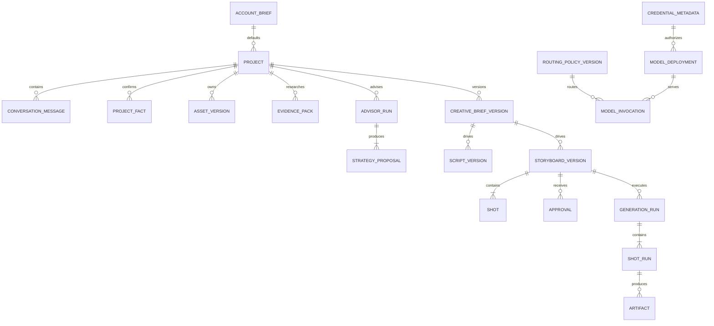

# 核心领域模型 v0.1

- 状态：待项目方评审
- 版本：0.1
- 日期：2026-09-05
- 负责人：待指定
- 适用范围：P0 创作主链路、模型管理后台和媒体执行

## 1. 设计目标

- 用户原始输入、确认事实、外部证据、AI 建议和用户决策分别保存。
- Creative Brief、Storyboard、路由策略和 Worker 输入采用不可变版本。
- 任何模型调用和媒体产物都能追溯到输入、Prompt、路由和确认版本。
- 单个 Shot 可以独立生成、失败、重试和降级。
- 平台核心不硬编码摩托车字段，领域差异由 Content Pack 承担。
- Provider、模型和 API Key 不进入创作领域对象。

## 2. 聚合边界



分为三个聚合：

1. `ProjectAggregate`：从用户输入到 Brief、Storyboard 和确认。
2. `GenerationAggregate`：从不可变 Storyboard 到 Shot Run、Artifact 和成片。
3. `ModelControlAggregate`：Provider、Credential、Deployment、Routing Policy 和 Model Invocation。

聚合之间只通过 ID 和不可变版本引用，不通过共享可变对象连接。

## 3. 通用字段规范

- ID：使用 UUIDv7 字符串，便于按时间排序。
- 时间：UTC RFC 3339，例如 `2026-09-05T08:00:00Z`。
- 版本：业务版本从 1 递增；Schema 版本使用语义字符串，例如 `1.0.0`。
- 金额：使用整数最小货币单位或 Decimal 字符串，禁止浮点累计。
- 语言：BCP 47，例如 `zh-CN`。
- Hash：`sha256:<hex>`。
- 用户可编辑文本保留原文，不做不可逆标准化。
- 删除采用状态和保留周期处理；被已确认版本引用的记录不物理覆盖。

## 4. ProjectAggregate

### 4.1 AccountBrief

账号级默认上下文，不是每个项目都必须填写。

| 字段 | 类型 | 说明 |
| --- | --- | --- |
| `id` | UUID | 账号简报 ID |
| `contentPackId` | string | 默认内容包 |
| `accountGoal` | string | 账号长期目标 |
| `audience` | string[] | 主要受众 |
| `tone` | string[] | 常用语气 |
| `publishingCadence` | string | 例如 daily |
| `preferences` | object | 常用时长、旁白、CTA 等 |
| `version` | integer | 乐观锁版本 |

项目创建时复制有效默认值，后续修改 AccountBrief 不静默改变已有项目。

### 4.2 Project

| 字段 | 类型 | 说明 |
| --- | --- | --- |
| `id` | UUID | 项目边界 |
| `title` | string | 用户可修改标题 |
| `contentPackId/version` | string | 固定本项目领域规则版本 |
| `mode` | enum | `real-subject` 或 `concept` |
| `targetPlatform` | enum | P0 为 `douyin` |
| `locale` | string | P0 为 `zh-CN` |
| `status` | enum | 见状态机文档 |
| `currentBriefVersionId` | UUID? | 当前确认或草稿 Brief |
| `currentStoryboardVersionId` | UUID? | 当前确认或草稿 Storyboard |
| `createdAt/updatedAt` | datetime | 审计时间 |
| `rowVersion` | integer | 乐观锁 |

### 4.3 ConversationMessage

保存用户和 AI 的原始对话。字段包括 `role`、`contentParts`、`assetVersionIds`、`createdAt`、`modelInvocationId` 和可选 `supersedesMessageId`。消息不可编辑覆盖；用户修正以新消息表达。

### 4.4 ProjectFact

表示已确认项目事实或硬约束：

| 字段 | 类型 | 说明 |
| --- | --- | --- |
| `id` | UUID | 事实 ID |
| `key` | string | 例如 `subject.vehicle.name` |
| `value` | JSON | 结构化值 |
| `sourceType` | enum | `user-message`、`user-asset`、`user-confirmation` |
| `sourceId` | UUID | 原始来源 |
| `confidence` | number | 0 到 1；用户确认固定为 1 |
| `status` | enum | `proposed`、`confirmed`、`superseded` |
| `supersedesFactId` | UUID? | 显式修正链 |

不变量：Evidence 和 LLM 输出不能更新 `confirmed` Fact。只有用户动作可以创建新的 Fact 并 supersede 旧 Fact。

### 4.5 AssetVersion

保存上传或生成素材的不可变版本：`assetId`、`version`、`kind`、`sourceType`、`uri`、`mimeType`、`sha256`、宽高/时长、分析结果、父 AssetVersion、生成来源和状态。文件替换创建新版本。

### 4.6 EvidencePack / EvidenceItem

EvidencePack 是一次研究快照，引用一个或多个 EvidenceItem。EvidenceItem 保存 URL、标题、发布时间/访问时间、摘录、用途、置信度、与 Project Fact 的冲突及抓取 Artifact。

Evidence 只能支持建议和候选事实。转为 Project Fact 必须经过明确用户确认。

### 4.7 AdvisorRun / StrategyProposal

AdvisorRun 引用 Project Facts、Account Brief 快照、EvidencePack、PromptVersion 和 RoutingPolicyVersion，状态为 `queued/running/completed/failed/cancelled`。

StrategyProposal 是该运行的不可变输出，必须符合 `creative-advisor.schema.json`。一个 AdvisorRun 产生 2 至 3 个 Proposal；用户修改或合并会创建新的 AdvisorRun/ProposalSet，不覆盖原结果。

### 4.8 CreativeBriefVersion

字段包括：

- `projectId`、`version`、`parentVersionId`。
- 来源 Proposal ID 列表和用户补充消息 ID。
- 受众、单一主要目标、内容类型、Hook、核心承诺、视觉回报。
- 语气、节奏、情绪峰值、CTA、必须保留和不得补写内容。
- 目标平台、语言、画幅、时长、素材计划和资源等级。
- `status`：`draft`、`approved`、`superseded`。
- `approvedAt` 与 Approval ID。

同一 Project 同时只能有一个当前 `approved` Brief。批准新版本后，依赖旧 Brief 的脚本和 Storyboard 标记为 `stale`，但不删除。

### 4.9 ScriptVersion

保存旁白段落、屏幕文字、声音方向和目标时长。它必须引用一个 CreativeBriefVersion。Script 可以单独版本化，但 P0 在 Storyboard 页面一起确认。

### 4.10 StoryboardVersion / Shot

StoryboardVersion 引用 CreativeBriefVersion 和 ScriptVersion，保存总时长、输出规格、Shot 顺序和状态。Shot 是版本内不可变子实体：

- 叙事目的、时间、时长。
- 画面、主体、动作、场景、景别、运镜和连续性要求。
- 旁白、字幕、声音和音乐提示。
- 首选/降级 Render Strategy。
- 输入 AssetVersion 和 Reference Pack 引用。
- 生成约束和用户来源标记。

编辑 Storyboard 草稿可以在事务内更新草稿 Shot；一旦批准，任何修改都克隆新 StoryboardVersion。

### 4.11 Approval

Approval 保存 `targetType`、`targetVersionId`、`decision`、`actorId`、`comment`、`createdAt` 和目标内容 Hash。P0 actor 可以是本机用户，但仍保留字段。Approval 记录不可修改。

## 5. GenerationAggregate

### 5.1 GenerationRun

一次针对已批准 Storyboard 的完整生成尝试：

- `storyboardVersionId`、`routingPolicyVersionId` 和 ContentPackVersion。
- 不可变 Shot Manifest ID 列表。
- 状态、预算、累计成本、开始/结束时间和取消请求。
- 最终合成 Artifact、质量报告和失败摘要。

同一个幂等键不能创建两个活动 Run。

### 5.2 ShotManifest

控制面到 Worker 的不可变中央契约，符合 `shot-manifest.schema.json`。LLM 不能直接生成可执行 Python 或命令；只能生成内容包允许的策略、模板和参数。

### 5.3 ShotRun

| 字段 | 说明 |
| --- | --- |
| `id/runId/shotId` | 归属 |
| `attempt` | 从 1 递增 |
| `strategy` | 本次真实使用策略 |
| `status` | 等待、运行、成功、失败、取消等 |
| `providerInvocationIds` | 模型/媒体调用 |
| `inputArtifactIds/outputArtifactIds` | 输入输出 |
| `errorCode/errorDetail` | 标准错误与脱敏细节 |
| `cost/startedAt/endedAt` | 资源记录 |

重试创建新 ShotRun，不覆盖失败记录。降级也创建新 Attempt，并记录 `degradedFromStrategy`。

### 5.4 Artifact

统一表示用户上传、Evidence 页面、参考图、视频、音频、字幕、帧序列、质量报告和成片。Artifact 保存类型、URI、Hash、大小、媒体元数据、生成来源、父 Artifact、状态和保留策略。

## 6. ModelControlAggregate

### 6.1 ModelProvider

保存稳定 Provider ID、显示名、适配器类型、Base URL、区域、非秘密连接参数和状态。Provider 不保存 API Key。

### 6.2 CredentialMetadata

只保存 Secret Store 引用：`id`、`providerId`、`alias`、`secretRef`、`lastFour`、状态、创建/轮换/最近使用时间和健康摘要。数据库没有明文或可逆密文列。

### 6.3 ModelDeployment

把 Provider、物理模型、CredentialMetadata 和能力限制组合为可路由单元。包含能力列表、上下文限制、并发/速率、超时、价格版本、探针结果和状态。

### 6.4 RoutingPolicyVersion

不可变发布版本，按能力别名定义 Primary、顺序 Fallback、必需能力、超时、最大尝试、允许 Fallback 的错误和预算等级。Draft 是可编辑工作副本，Publish 后创建不可变版本。

### 6.5 PromptVersion

PromptVersion 保存能力别名、Content Pack、系统提示、Few-shot Fixture、工具白名单、输入/输出 Schema 引用、模型参数边界和 Hash。Prompt 与 Routing Policy 独立发布。

### 6.6 ModelInvocation

记录每次实际调用：能力别名、Prompt/Schema/路由版本、真实 Deployment、Credential ID、Provider Request ID、Token、缓存、延迟、费用、重试/Fallback 父调用、标准错误和输出对象引用。不得记录 Key。

## 7. 一致性与优先级规则

1. `confirmed ProjectFact > user asset analysis > Evidence > model assumption`。
2. 已批准 Brief/Storyboard/Route 不更新原记录，只创建新版本。
3. GenerationRun 只能引用已批准且非 stale 的 Storyboard。
4. Shot Manifest 生成后不可修改；重试复用或显式创建新 Manifest 版本。
5. Route 发布只影响新 ModelInvocation；Run 保存启动时快照。
6. Credential 撤销立即阻止新调用，但历史 Invocation 保留 Credential ID。
7. 所有外部副作用接口使用 `Idempotency-Key`。

## 8. 建议数据库表

P0 最小表：

```text
account_briefs
projects
conversation_messages
project_facts
asset_versions
evidence_packs
evidence_items
advisor_runs
strategy_proposals
creative_brief_versions
script_versions
storyboard_versions
shots
approvals
generation_runs
shot_manifests
shot_runs
artifacts
model_providers
credential_metadata
model_deployments
routing_policy_drafts
routing_policy_versions
prompt_versions
model_invocations
```

推荐索引：所有外键；`projects(status, updated_at)`；`project_facts(project_id, key, status)`；`shots(storyboard_version_id, position)`；`shot_runs(run_id, shot_id, attempt)`；`model_invocations(project_id, created_at)`；`model_invocations(capability_alias, status, created_at)`。

## 9. 并发与幂等

- 可编辑 Project、Draft 和管理配置使用 `rowVersion` 乐观锁。
- 生成、重试、取消、发布路由和 Key 轮换要求 `Idempotency-Key`。
- Worker 领取 ShotRun 使用数据库原子更新或队列租约。
- Artifact 写入采用临时对象、校验 Hash、再原子标记 ready。
- Webhook 按 Provider Event ID 去重。

## 10. P0 验收

- 张雪 800X 的 confirmed Fact 不会被冲突 Evidence 覆盖。
- 合并两个 Proposal 生成新的 CreativeBriefVersion，并保留来源 ID。
- 批准新 Brief 后旧 Storyboard 被标记 stale，历史仍可查看。
- 修改一个已批准 Shot 会创建新 StoryboardVersion，只让相关 Shot 重新执行。
- 发布模型路由不会改变运行中的 GenerationRun 路由快照。
- Credential 表和所有 API 响应不存在明文 Key。
- 所有外部调用和最终 Artifact 可反向追溯到确认版本。

## 11. 待评审项

1. 是否接受 UUIDv7、PostgreSQL 和不可变版本模型。
2. P0 是否允许只有一个 AccountBrief；建议允许一个默认账号简报但数据模型支持多个。
3. P0 用户身份使用固定本机 Actor，外部部署前再接正式登录。
4. 原始模型响应的默认保存周期尚待确定；建议 P0 为 7 天，结构化结果长期随项目保留。
