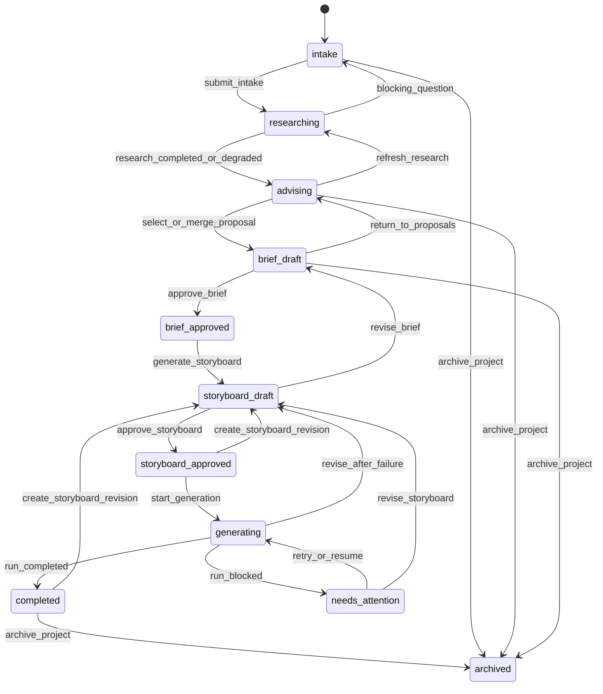
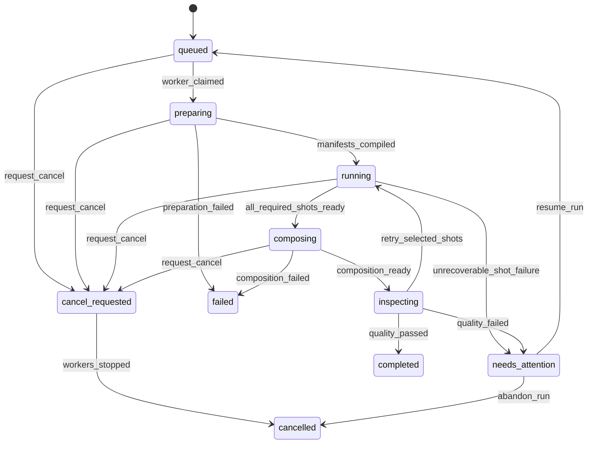
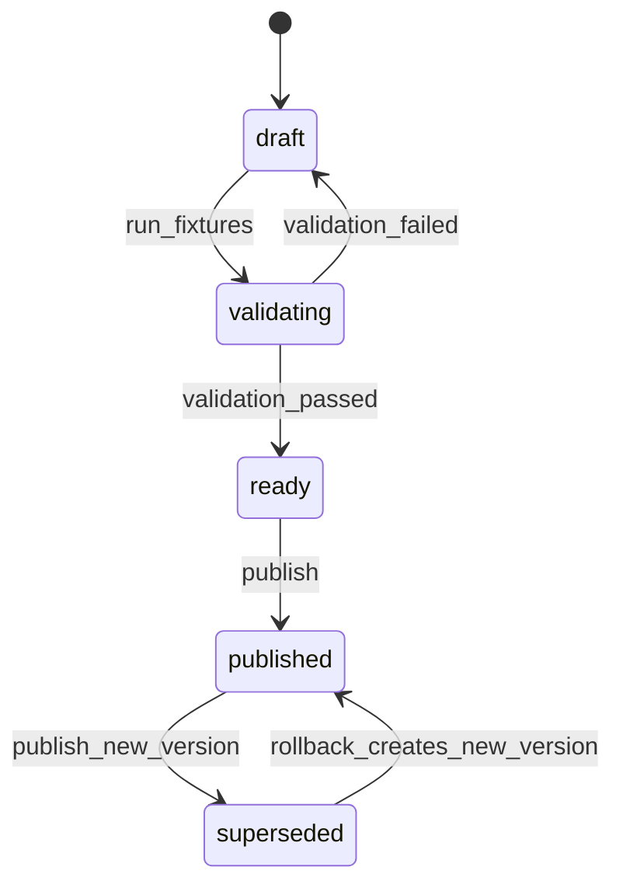

# 工作流状态机 v0.1

- 状态：待项目方评审
- 版本：0.1
- 日期：2026-09-05
- 负责人：待指定
- 适用范围：项目创作、版本确认、媒体运行和模型配置发布

## 1. 原则

- 状态由服务端持久化，前端只发送意图，不直接设置状态。
- 所有状态变更在事务中写入当前状态、状态事件和操作者。
- 已批准版本不可修改；修订必须创建新版本。
- 自动重试只发生在明确可重试错误、预算和次数范围内。
- Project 状态是面向用户的汇总，不替代 Brief、Storyboard、Run 和 ShotRun 的细粒度状态。
- 长任务中断后从持久化状态恢复，不依赖 Web 连接存活。

## 2. Project 状态



| 状态 | 含义 | 普通用户主要动作 |
| --- | --- | --- |
| `intake` | 收集想法、素材和事实 | 补充、上传、提交 |
| `researching` | 检索并建立 Evidence | 继续补充、取消检索 |
| `advising` | 比较和修订 Proposal | 采用、合并、追问 |
| `brief_draft` | 编辑 Creative Brief | 修改、批准、返回策略 |
| `brief_approved` | Brief 已锁定 | 生成脚本分镜、创建修订 |
| `storyboard_draft` | 编辑脚本和镜头 | 排序、修改、批准 |
| `storyboard_approved` | Storyboard 已锁定 | 生成、创建修订 |
| `generating` | 存在活动 GenerationRun | 查看、取消 |
| `needs_attention` | 自动处理耗尽，需要决定 | 重试、降级、返回修改 |
| `completed` | 当前版本已有合格成片 | 下载、创建修订 |
| `archived` | 项目不再活跃 | 恢复或查看历史 |

Project 的汇总状态由领域服务根据当前版本和活动 Run 计算，不能由 Worker 任意写入。

## 3. Creative Brief 生命周期

```text
draft -> approved -> superseded
  |         |
  +-> discarded
```

- `draft`：可编辑，使用 `rowVersion` 乐观锁。
- `approved`：不可变，并写入 Approval 和内容 Hash。
- `superseded`：新 approved 版本取代当前版本；历史可查看。
- `discarded`：未批准草稿被用户放弃。

规则：

1. `approve_brief` 前执行 Creative Brief Schema、Project Fact 和内容包规则校验。
2. 新 Brief 批准时，同事务将旧 approved Brief 标记 superseded。
3. 所有依赖旧 Brief 的 Script/Storyboard 标记 `stale`。
4. Stale 不等于删除；用户可以查看、复制，但不能从它直接开始新 GenerationRun。

## 4. Storyboard 生命周期

```text
generating-draft -> draft -> approved -> stale
        |             |         |
        +-> failed    +-> discarded
```

- `generating-draft`：LLM 正在生成结构化结果。
- `draft`：Schema 校验通过，可编辑。
- `approved`：不可变，可编译 Shot Manifest。
- `stale`：上游 Brief 已变化或用户创建修订。
- `failed`：生成失败且无有效草稿。
- `discarded`：用户放弃未批准草稿。

Storyboard 批准条件：

- 引用当前 approved Creative Brief。
- 通过 `storyboard.schema.json`。
- Shot position 唯一连续，总时长等于 Shot duration 之和，误差为 0。
- 旁白引用的 segmentKey 存在。
- 每个 Shot 至少有一个可用策略，引用的 AssetVersion 为 ready。
- 总时长、分辨率和帧率在内容包与 P0 范围内。

## 5. GenerationRun 状态



| 状态 | 终态 | 说明 |
| --- | --- | --- |
| `queued` | 否 | 已持久化，等待 Worker |
| `preparing` | 否 | 冻结路由快照并编译 Manifest |
| `running` | 否 | 一个或多个 ShotRun 活跃 |
| `composing` | 否 | 合成时间线 |
| `inspecting` | 否 | 媒体和视觉质量检查 |
| `needs_attention` | 否 | 自动尝试耗尽 |
| `cancel_requested` | 否 | 已阻止新子任务，等待活动任务停止 |
| `completed` | 是 | 质量通过且最终 Artifact ready |
| `failed` | 是 | 准备/合成发生不可恢复错误 |
| `cancelled` | 是 | 所有活动子任务停止或超时隔离 |

取消是协作式操作。若外部 Provider 不支持取消，平台停止后续消费并将迟到结果标为 orphaned，不把它挂到最终成片。

## 6. ShotRun 状态

```text
queued -> running -> validating -> succeeded
   |         |            |
   |         +-> retry_wait -> queued (new attempt)
   |         +-> failed
   |         +-> cancel_requested -> cancelled
   +-> cancelled
```

标准状态：`queued`、`running`、`validating`、`retry_wait`、`succeeded`、`failed`、`cancel_requested`、`cancelled`、`orphaned`。

重试规则：

- 每次 Attempt 是新 ShotRun，旧记录不更新为成功。
- Provider 限流、超时和临时不可用按 Manifest 预算退避重试。
- 鉴权失败隔离 Credential，不在同一 Key 上重试。
- 输入/Schema 无效不自动重试，回到编译或 Storyboard 修改。
- 质量失败只能对质检报告指定的 Shot 重试。
- 达到最大 Attempts 或成本上限后进入 needs_attention。
- 用户选择降级时，记录原策略和新策略，并创建新 Attempt。

## 7. AdvisorRun 与 ModelInvocation

AdvisorRun：`queued -> researching -> generating -> validating -> completed`，任一步可到 `failed/cancelled`。搜索失败允许转为 `generating`，但必须写入 degraded 标记和依据范围。

ModelInvocation：

```text
created -> routing -> calling -> streaming -> validating -> succeeded
                           |           |           |
                           +-----------+-----------+-> failed
                                                   -> fallback_pending
fallback_pending -> calling (new invocation with parentInvocationId)
```

已经向用户展示部分 Streaming 内容后发生 Fallback，服务端先发送 `restart` 事件，前端清除该轮临时内容，再显示新模型完整结果。

## 8. 模型管理状态

### 8.1 Credential

`draft -> active -> draining -> revoked`，探针/调用失败可进入 `error`；修复后只能通过重新测试回到 active。

### 8.2 ModelDeployment

`draft -> testing -> ready -> degraded -> disabled`。只有 ready/degraded 且满足能力的 Deployment 可进入 Draft Route；默认不允许 degraded 作为 Primary 发布。

### 8.3 Routing Policy



回滚不是重新激活旧数据库行，而是以旧内容创建一个新的 published 版本，从而保持单调版本号和完整审计链。

## 9. 事件与 Outbox

关键状态变更同时写入 `domain_events`/Outbox，由后台发布：

- `project.intake_submitted`
- `advisor.proposals_ready`
- `creative_brief.approved`
- `storyboard.approved`
- `generation.started/cancel_requested/completed/failed`
- `shot.attempt_started/succeeded/failed`
- `artifact.ready`
- `model_route.published/rolled_back`
- `credential.rotated/revoked`

数据库状态和 Outbox 必须在同一事务写入，防止状态已变但任务未提交。

## 10. 幂等、超时与恢复

- 创建 Run、批准版本、重试 Shot、发布/回滚 Route 和轮换 Key 必须带 `Idempotency-Key`。
- 相同 Key、Actor 和 Endpoint 在 24 小时内返回相同业务结果。
- Worker 任务有 lease 和 heartbeat；lease 超时后由恢复器判断重领或隔离。
- 超时不直接等于失败：先查询 Provider 状态；无法确认时标记 unknown 并人工/定时对账。
- 服务重启后扫描非终态 Run 和过期 lease，恢复队列。
- 所有状态命令检查期望版本，冲突返回 HTTP 409。

## 11. 权限

- 普通用户：编辑自己的项目、批准 Brief/Storyboard、启动/取消/重试自己的 Run。
- `model-admin`：管理 Provider、Credential、Deployment、Route 和测试台。
- `viewer`：查看脱敏模型配置和调用记录。
- P0 本机模式使用固定 Actor；外部部署前必须启用真实身份和资源级校验。

## 12. 验收场景

1. 用户批准 Brief 后重复提交相同 Idempotency-Key，只产生一个 Approval。
2. 新 Brief 获批，旧 Storyboard 立即 stale，不能开始 Run。
3. 一个 Shot 超时后只重试该 Shot，成功后继续合成。
4. 用户取消时不再启动新 Shot；迟到结果成为 orphaned。
5. 服务在 running 中重启，恢复后不重复创建已成功 Artifact。
6. Route 在 AdvisorRun 中途发布新版本，本次 Run 仍使用旧快照。
7. 回滚 Route 创建新版本，历史 Invocation 仍引用原版本。
8. Key 撤销后新调用被拒绝，已有调用按超时策略收口。

## 13. 待评审项

1. P0 幂等结果保存 24 小时是否足够。
2. 用户取消后是否保留已经成功的中间镜头；建议保留到项目默认清理周期。
3. P0 自动重试上限建议为每个外部调用 1 次、每个 Shot 总 Attempt 3 次。
4. 外部 Provider 状态未知时，P0 是否允许管理员手动标记失败并重试。
